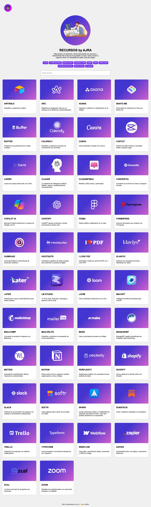

# DIRECTORIO DE RECURSOS by AJRA

Bienvenido a mi directorio, donde descubrirás los recursos y herramientas No-Code que te ayudarán a crear y hacer crecer tu negocio online, sin necesidad de saber nada de código.

## Sobre el Proyecto

Este directorio cubre herramientas en las categorías de Automatizaciones, Bases de Datos, Desarrollo Web, Email, Formularios, IA, Productividad y Utilidades varias. 
La idea es ofrecer un recurso útil que ayude a la comunidad a estar informada sobre herramientas No-Code que puedan ayudarte a crear y hacer crecer tu negocio online sin necesidad de saber codigo.

Accesible en [recursos.ajra.es](https://recursos.ajra.es), este sitio está construido con Jekyll, aprovechando su potencia para generar páginas estáticas eficientes y fáciles de mantener.

## Características

- **Diversidad de Categorías**
- **Actualizaciones Constantes**
- **Fácil Navegación**

## Tecnologías Utilizadas

Este sitio se desarrolló utilizando Jekyll, una elección popular para sitios web estáticos debido a su simplicidad y eficiencia. HTML y CSS se utilizan para estructurar y estilizar el sitio, garantizando una experiencia de usuario agradable y accesible.

## Contacto

¿Conoces un recurso o herramienta que debería estar en nuestra lista? 
¡Nos encantaría incluirlo! 
Tan solo avísame con un email a [info@ajra.es](mailto:info@ajra.es).

Igual para cualquier sugerencia, pregunta o colaboración. ¡Tus comentarios y aportaciones son bienvenidos!

Gracias por visitar y contribuir al DIRECTORIO DE RECURSOS de AJRA.